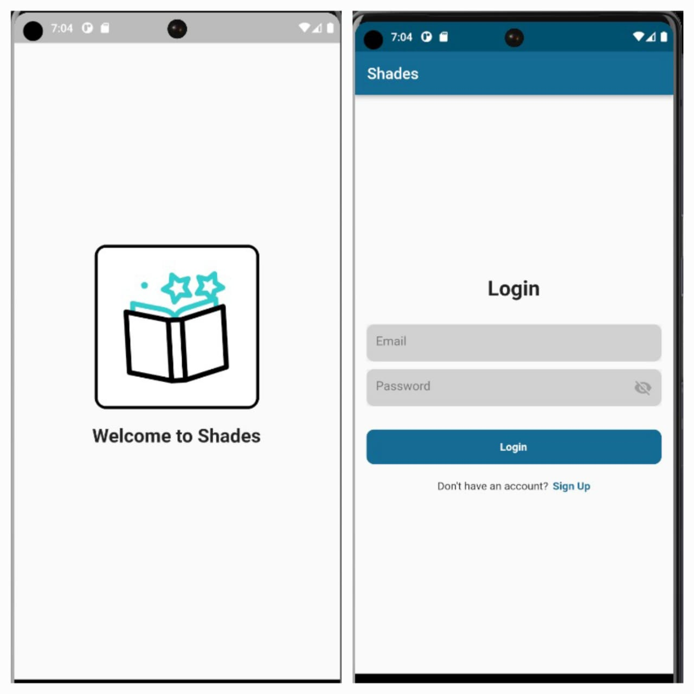
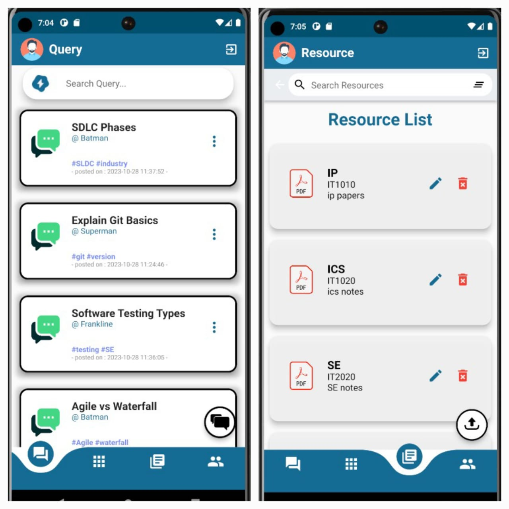
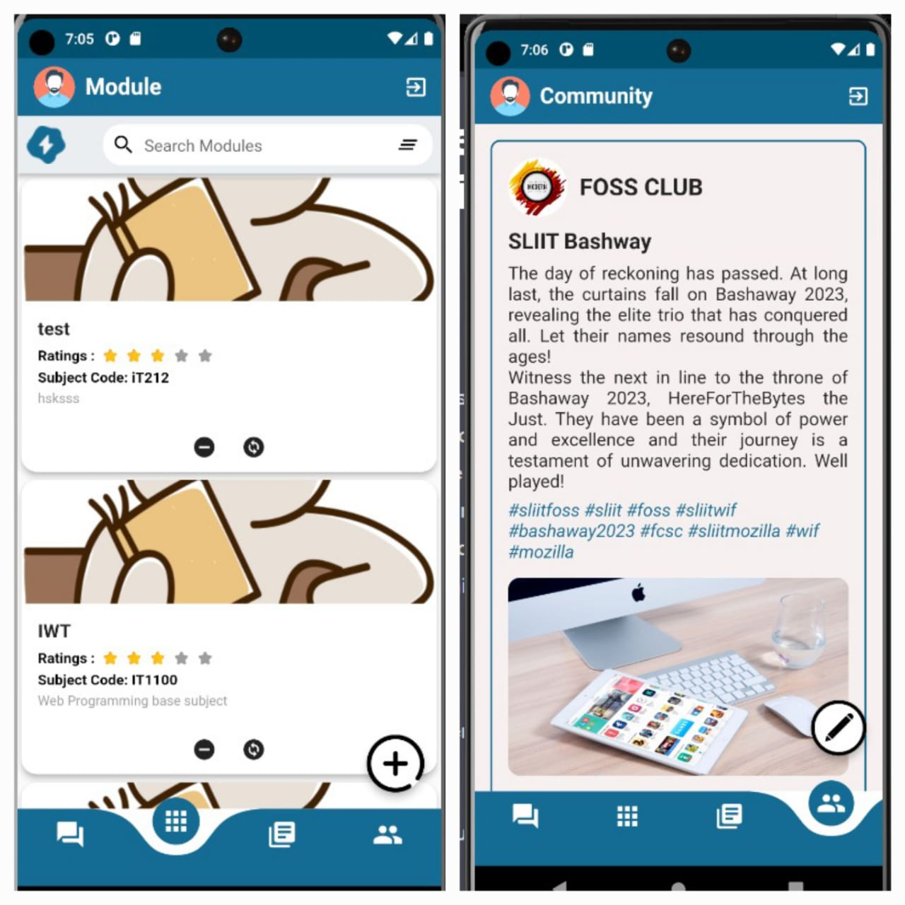

# Shades: Empowering University Students through Academic Community

## Introduction

Shades is a mobile application thoughtfully crafted to address the academic challenges faced by university students. It recognizes the need for practical, experience-based knowledge and open academic discussions to enhance students' overall academic performance and reduce the stress that often accompanies university life. With Shades, we aim to bridge the gap by providing a dedicated platform that connects students, senior peers, and academic resources, facilitating a thriving academic community.

## Features

Shades offers a range of features designed to empower university students:

1. **Modules Listings and Reviews**:
   - Access detailed module listings with reviews by senior students who have completed the module.
   - Gain insights into module difficulty, time requirements, importance, key assignments, and more.

2. **Resource Listings**:
   - Discover a wealth of valuable resources curated by senior students, including papers, articles, websites, and module-related notes.

3. **Discussion Forum**:
   - Engage in open discussions on crucial academic topics, where questions are answered by seniors and bright students willing to help.
   - Similar to Stack Overflow, the best questions and answers are upvoted to the top.

4. **Community Page for University Student Bodies**:
   - Connect with verified university club members to organize, announce, and discuss academic topics.
   - Participate in seminars, polls, and other informative events related to your academic journey.

The entire platform is community-moderated, ensuring a safe and constructive environment for academic discussions and resource sharing. Verified community members from university student bodies play a crucial role in maintaining the quality and relevance of content.

## Technologies Used
Shades is built using the following technologies:
- **Firebase**: For robust and scalable backend services, including user authentication, database management, and cloud functions.
- **Flutter**: For creating a seamless and cross-platform mobile application that offers an engaging user experience.

## Contributors

Shades is the result of collaborative efforts from a dedicated team of contributors who share the vision of enhancing the academic experience for university students. We're grateful for their hard work and commitment to this project.
* IT21289316 - Harish.B </br>
* IT21269134 - Kumbukgolla K.G.I.H.C </br>
* IT21272240 - Perera K.P.R.T </br>
* IT21258480: Dissanayake D.M.P.D </br>


<p align ="center"> 



</p>


## Getting Started

To begin your journey with Shades, follow these simple steps:

1. **Clone the Repository**:
   ```
   git clone https://github.com/your-username/Shades.git
   cd Shades
   ```

2. **Set Up Firebase**:
   - Create a Firebase project and set up the necessary configurations for authentication, Firestore, and Cloud Functions.
   - Update your Firebase configuration in the project code.

3. **Set Up Flutter**:
   - Make sure you have Flutter installed. If not, refer to the official Flutter documentation for installation instructions.
   - Install dependencies using:
     ```
     flutter pub get
     ```

4. **Run Shades**:
   - Launch the app on your preferred platform (iOS or Android) using the following command:
     ```
     flutter run
     ```

Now, you're all set to explore the Shades application and join a thriving academic community that empowers university students to excel in their studies.

Empower your academic journey with Shades!
